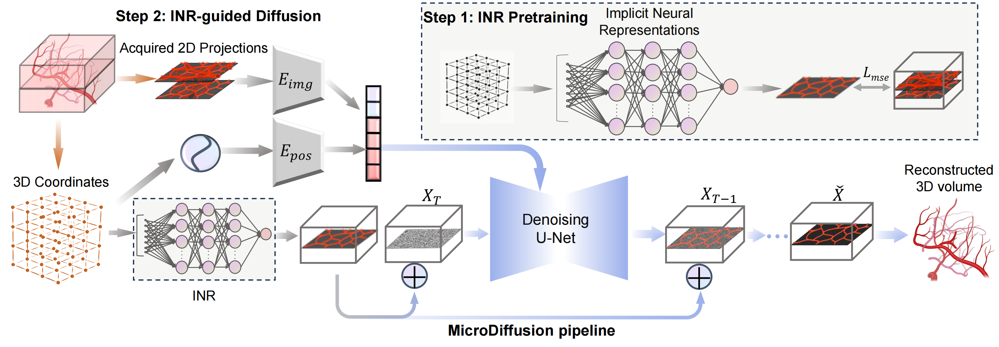

# MicroDiffusion: Implicit Representation-Guided Diffusion for 3D Reconstruction from Limited 2D Microscopy Projections

This is the official repository for our paper: "MicroDiffusion: Implicit Representation-Guided Diffusion for 3D Reconstruction from Limited 2D Microscopy Projections."


## Abstract:
Volumetric optical microscopy using non-diffracting beams enables rapid imaging of 3D volumes by projecting them axially to 2D images but lacks crucial depth information. Addressing this, we introduce MicroDiffusion, a pioneering tool facilitating high-quality, depth-resolved 3D volume reconstruction from limited 2D projections. 
While existing Implicit Neural Representation (INR) models often yield incomplete outputs and Denoising Diffusion Probabilistic Models (DDPM) excel at capturing details, our method integrates INR's structural coherence with DDPM's fine-detail enhancement capabilities. We pretrain an INR model to transform 2D axially-projected images into a preliminary 3D volume. This pretrained INR acts as a global prior guiding DDPM's generative process through a linear interpolation between INR outputs and noise inputs. This strategy enriches the diffusion process with structured 3D information, enhancing detail and reducing noise in localized 2D images.
By conditioning the diffusion model on the closest 2D projection, MicroDiffusion substantially enhances fidelity in resulting 3D reconstructions, surpassing INR and standard DDPM outputs with unparalleled image quality and structural fidelity.


<div align="center">
  
</div>
<div align="center">
  
</div>

## Data and Weight
Our data and weight are available at [DropBox](https://www.dropbox.com/scl/fo/wq9yfbcanv186zkzfvb8y/AF08CJuhrzb6zGHxGPVQnxM?rlkey=l144vlr4d7vi6t24clxyyp4r5&dl=0)

## Citation

If you find our work helpful, please consider citing:

```bibtex
@article{hui2024microdiffusion,
  title     = {MicroDiffusion: Implicit Representation-Guided Diffusion for 3D Reconstruction from Limited 2D Microscopy Projections},
  author    = {Hui, Mude and Wei, Zihao and Zhu, Hongru and Xia, Fei and Zhou, Yuyin.},
  journal   = {Conference on Computer Vision and Pattern Recognition (CVPR)},
  year      = {2024},
}
```

## Acknowledge
This work is partially supported by TPU Research Cloud (TRC) program, and Google Cloud Research Credits program.

The code is built on [nerfmm](https://github.com/ActiveVisionLab/nerfmm) and [classifier-free-diffusion-guidance-Pytorch](https://github.com/coderpiaobozhe/classifier-free-diffusion-guidance-Pytorch?tab=readme-ov-file). Many thanks to the awesome works from the open-source community!
